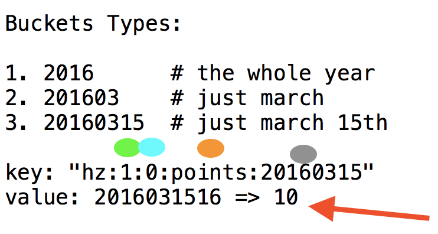

# Point Space Daemon (psd)

(try to not think of adobe psd, different psd)

PSD collects and aggregates data into a very neat data 
structure made up of collections of hashes.  



* Bucket Types

Writes are expensive, reads are cheap. When we write, we write to ALL the bucket types, the same information, repeated over and over for a good reason. Bucket Types 1-3 are shown in image above but there are more for just the hour of march 15th from 13:00 to 13:59, and just the second from 13:59:01 to 13:59:02. i.e. we write the updates to the bucket for the whole year and for just 1 second and everything in between (min, hour, day, month)

* Green

The green oval is over the "1" in the string key. This represents the user_id.

* Blue

The blue oval is over the "0" in the string key. This is the activity_type id. (And zero is a special value for this meaning, ALL your activities.)

* Orange

The orange oval is over the "points" in the string key. This is the metric, either points, steps, or distance.

* Gray

The gray oval is over the "timebucket" in the string key.

* Red Arrow

Notice the red arrow shows the value inside that full key `"hz:1:0:points:20160315"` and it's
`2016031516 => 10`. 

The 10 means 10 points were earned during that second. Replace points with steps and you get the idea of how we store both and then can query for either. And then to sum up these integers in all these different buckets, we use
the Lua interpreter built into Redis starting from version 2.6.0 

https://redis.io/commands/eval

And so asking for the sum of all the steps for the last 23 days 4 hours and 3 seconds is easy.

Notice how 2016031516 has that 16 on the end and 20160315 is two characters shorter. So another key in that hash will be 2016031517. But both 2016031516 and 2016031517 are under 20160315.

It lets us ask the question "how many points did this user get from 
this point in time, to that point in time?"

PSD does this in such a way that its almost as cheap to query a summary 
from a specific second in a specific day 82 days ago, to now, filtered 
by an activity type, and broken down in whatever granularities you like, 
as it is, to just ask for what was logged for today alone.

We use this for 30 day challenges, 24 hour challenges and every leaderboard 
you see, including our new bracket system! We can tell what your leaderboard
looked like at a certain point in time, and compare that to your leaderboard 
now, or anyones elses. You can [download the app](http://activity.club) and see.

## Running locally

You will need nsq, redis, golang. There are three main parts to psd:

1. Input via a queue of async jobs
2. Input via sync http post
3. Output via http gets or posts

So you compile the go code, and run `./pointspaced worker` to start it reading jobs from nsq.
And in another terminal you run `./pointspaced server` to run the http server.
Make your own `conf/settings.toml` file from `conf/settings.toml.dist` example and that has ports
and hosts for redis, nsq, http.

## building

to start pointspaced, you gotta do
nsqd -lookupd-tcp-address=127.0.0.1:4160 &
nsqadmin -lookupd-http-address=127.0.0.1:4161 &
nsqlookupd &
./pointspaced worker
redis-server &
then you should be able to do ruby scripts/enqueue.rb

## details

```
	// we will write 10, 11, 1 point
	WritePoint("points", 1, 10, 3, 1458061005) // 2016-03-15 16:56:45
	WritePoint("points", 1, 11, 3, 1458061008) // 2016-03-15 16:56:48
	WritePoint("points", 1, 1, 3, 1458061011)  // 2016-03-15 16:56:51
	// lets try to read all but the last 16:56:45 to 16:56:50
	ReadBuckets([]int64{1}, "points", []int64{3}, 1458061005, 1458061010, "0")
```
```
1460078760.683793 [0 127.0.0.1:49279] "SCRIPT" "LOAD" "local sum = 0\nfor _, packed in ipairs(ARGV) do\n  local unpacked = cmsgpack.unpack(packed)\n  local cscore\n  for i, v in ipairs(redis.call('HGETALL', unpacked[1])) do\n    if i % 2 == 1 then\n    cscore = tonumber(v)\n    else\n      if cscore >= unpacked[2] and cscore <= unpacked[3] then\n        sum = sum + v\n      end\n    end\n  end\nend\nreturn sum"
1460078760.693822 [0 127.0.0.1:49279] "flushall"
1460078760.694720 [0 127.0.0.1:49279] "HINCRBY" "hz:1:0:points:2016" "201603" "10"
1460078760.694837 [0 127.0.0.1:49279] "HINCRBY" "hz:1:3:points:2016" "201603" "10"
1460078760.694957 [0 127.0.0.1:49279] "HINCRBY" "hz:1:0:points:201603" "20160315" "10"
1460078760.695067 [0 127.0.0.1:49279] "HINCRBY" "hz:1:3:points:201603" "20160315" "10"
1460078760.695169 [0 127.0.0.1:49279] "HINCRBY" "hz:1:0:points:20160315" "2016031516" "10"
1460078760.695278 [0 127.0.0.1:49279] "HINCRBY" "hz:1:3:points:20160315" "2016031516" "10"
1460078760.695378 [0 127.0.0.1:49279] "HINCRBY" "hz:1:0:points:2016031516" "201603151656" "10"
1460078760.695493 [0 127.0.0.1:49279] "HINCRBY" "hz:1:3:points:2016031516" "201603151656" "10"
1460078760.695662 [0 127.0.0.1:49279] "HINCRBY" "hz:1:0:points:201603151656" "20160315165645" "10"
1460078760.695783 [0 127.0.0.1:49279] "HINCRBY" "hz:1:3:points:201603151656" "20160315165645" "10"
1460078760.695899 [0 127.0.0.1:49279] "HINCRBY" "hz:1:0:points:2016" "201603" "11"
1460078760.696010 [0 127.0.0.1:49279] "HINCRBY" "hz:1:3:points:2016" "201603" "11"
1460078760.696134 [0 127.0.0.1:49279] "HINCRBY" "hz:1:0:points:201603" "20160315" "11"
1460078760.696256 [0 127.0.0.1:49279] "HINCRBY" "hz:1:3:points:201603" "20160315" "11"
1460078760.696373 [0 127.0.0.1:49279] "HINCRBY" "hz:1:0:points:20160315" "2016031516" "11"
1460078760.696461 [0 127.0.0.1:49279] "HINCRBY" "hz:1:3:points:20160315" "2016031516" "11"
1460078760.696574 [0 127.0.0.1:49279] "HINCRBY" "hz:1:0:points:2016031516" "201603151656" "11"
1460078760.696682 [0 127.0.0.1:49279] "HINCRBY" "hz:1:3:points:2016031516" "201603151656" "11"
1460078760.696826 [0 127.0.0.1:49279] "HINCRBY" "hz:1:0:points:201603151656" "20160315165648" "11"
1460078760.696931 [0 127.0.0.1:49279] "HINCRBY" "hz:1:3:points:201603151656" "20160315165648" "11"
1460078760.697043 [0 127.0.0.1:49279] "HINCRBY" "hz:1:0:points:2016" "201603" "1"
1460078760.697138 [0 127.0.0.1:49279] "HINCRBY" "hz:1:3:points:2016" "201603" "1"
1460078760.697283 [0 127.0.0.1:49279] "HINCRBY" "hz:1:0:points:201603" "20160315" "1"
1460078760.697401 [0 127.0.0.1:49279] "HINCRBY" "hz:1:3:points:201603" "20160315" "1"
1460078760.697545 [0 127.0.0.1:49279] "HINCRBY" "hz:1:0:points:20160315" "2016031516" "1"
1460078760.697682 [0 127.0.0.1:49279] "HINCRBY" "hz:1:3:points:20160315" "2016031516" "1"
1460078760.697783 [0 127.0.0.1:49279] "HINCRBY" "hz:1:0:points:2016031516" "201603151656" "1"
1460078760.697918 [0 127.0.0.1:49279] "HINCRBY" "hz:1:3:points:2016031516" "201603151656" "1"
1460078760.698018 [0 127.0.0.1:49279] "HINCRBY" "hz:1:0:points:201603151656" "20160315165651" "1"
1460078760.698137 [0 127.0.0.1:49279] "HINCRBY" "hz:1:3:points:201603151656" "20160315165651" "1"
1460078760.698529 [0 127.0.0.1:49279] "EVALSHA" "55da2d225f3d9725e7a6ab64359b466ba7d721b2" "0" "\x93\xbahz:1:0:points:201603151656\xcf\x00\x00\x12U\xf0l\x8b\xcd\xcf\x00\x00\x12U\xf0l\x8b\xd2"
1460078760.698570 [0 lua] "HGETALL" "hz:1:0:points:201603151656"
```
